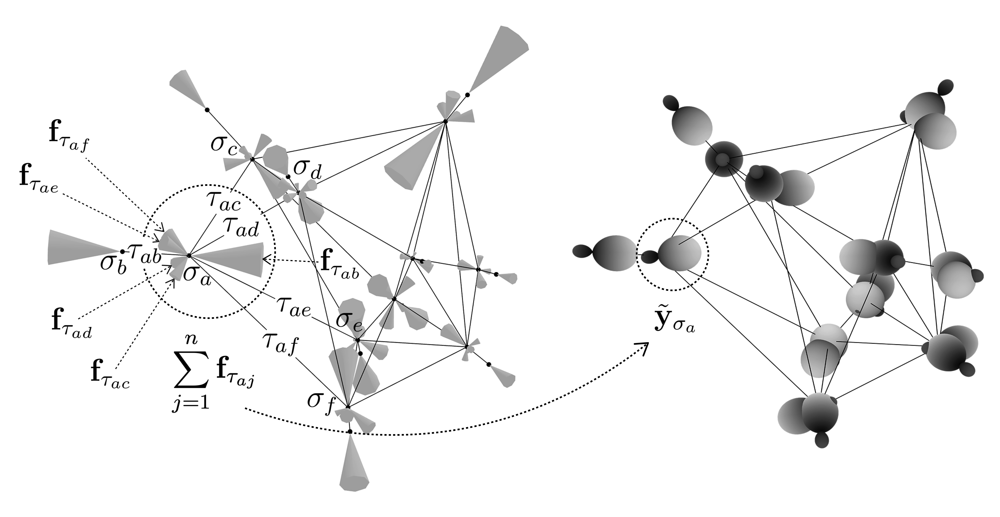
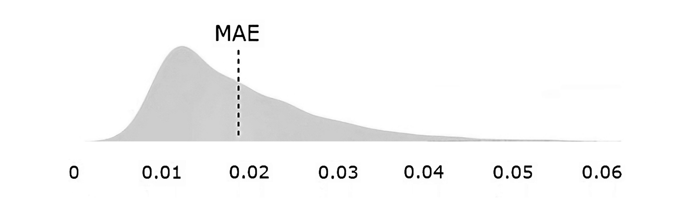

# Experiment: 3DGS20 - Force Prediction in 3D Graphic Statics

## Dataset

  

*Processed data sample. Left: compression force vectors $`\mathbf{f}_{\tau_{ij}} \subset \mathbf{y}_{\sigma_i}`$. Right: glyph plot of the spherical harmonic embeddings $`\tilde{\mathbf{y}}\_{\sigma\_{i}}`$.*

The dataset comprises 30,000 $1$-complexes. Within each complex, there are 20 $0$-cells, $\sigma\_i$, characterised by a positional vector $\mathbf{p}\_i \in \mathbb{R}^3$. Each complex contains 34 $1$-cells, $\tau\_{ij} = \{\sigma\_i,\sigma\_j\}$.

For each 1-cell, denoted as $\tau\_i$, a magnitude $f\_{\tau\_i} [\text{N}]$ is assigned. This scalar value quantifies the magnitude of the compression force exerted on the 1-cell. To construct a force vector $\mathbf{f}\_{\tau\_{ij}}$ in $\mathbb{R}^3$, this magnitude is combined with a direction. The direction is determined by the positional vectors $\mathbf{p}\_j$ and $\mathbf{p}\_i$, which are the spatial coordinates of the neighboring 0-cell $\sigma\_j$ and the 0-cell $\sigma\_i$, respectively.

The force vector $\mathbf{f}\_{\tau\_{ij}}$ thus encapsulates both the magnitude and direction of the force exerted on $\sigma\_i$ due to its interaction with $\sigma\_j$. For a given 0-cell $\sigma\_i$, there exist $n$ such force vectors, where $n$ corresponds to the number of neighboring 0-cells. The aggregation of these force vectors yields a resultant force vector, which serves as the ground truth vector, $\mathbf{y}\_{\sigma\_i} \in \mathbb{R}^3$, for the $i$-th 0-cell:

$$\mathbf{y}\_{\sigma\_i} = \sum\_{j=1}^{n} \mathbf{f}\_{\tau\_{ij}}$$

Each $0$-cell $\sigma\_i$ is associated with a feature vector $\mathbf{x}\_{\sigma\_i} \in \mathbb{R}^3$, defined as:
$$\mathbf{x}\_{\sigma\_i} = \sum\_{j=1}^{n} \mathbf{d}\_{ji}$$
where $\mathbf{d}\_{ji} = \mathbf{p}\_i - \mathbf{p}\_j$.

Lastly, each $1$-cell $\tau\_{i}$ is associated with an attribute $\mathbf{a}\_{\tau\_i}$, which is calculated as the Euclidean distance between the position vectors of its constituent $0$-cells:
$$\mathbf{a}\_{\tau\_i} = \lVert \mathbf{p}\_j - \mathbf{p}\_i \rVert$$

## Implementation of composite harmonic expansions and CG TP

Converting feature vectors $\mathbf{x}\_{\sigma\_i}$, attribute vectors $\mathbf{a}\_{\tau\_i}$, and ground truth vectors $\mathbf{y}\_{\sigma\_i}$ into composite steerable vectors necessitates the specification of the types $l$ of basis functions involved, as well as the multiplicities of each type. 
A type-$l$ vector, characterised by its dimension $2l+1$, pertains to scalar quantities if $l=0$, to vectors if $l=1$, and to rank-2 tensors if $l=2$. Higher orders ($l > 2$) are generally less prevalent in practice. Importantly, multiple basis functions of an identical type $l$ may co-exist within the same representation. 

For the effective implementation of composite steerable vectors and irreducible representations, we utilise the \textit{e3nn} library \autocite{geiger2022}, which provides a comprehensive framework that enables the formulation of composable $G$-morphic operations for learning tasks involving three-dimensional data.

We set the number of hidden features to 32 and restrict the $\text{max}(l)$ to 2 for features and to 1 for attributes. Following this setting, the basis functions that form the hidden representations, $\mathbf{f}\_i$, are distributed so: `13x0e+3x1o+2x2e`, which is a symbolic notation within the e3nn framework. This nomenclature indicates that there are 13 or irreducible representations of type $l=0$, 3 of type $l=1$, and 2 of type $l=2$. Given that type $l=0$ has a single mode, type $l=1$ has 3 modes, and type $l=2$ has 5 modes, the total amounts to $13\times1 + 3\times3 + 2\times5 = 32$ basis functions. 
The suffixes `e` and `o` serve as parity indicators, representing even and odd parities respectively among the basis functions. It is noteworthy that the parity properties of spherical harmonics are intrinsically linked to their type $l$.

Parity transformation or parity inversion is the flip in the sign of spatial coordinates. For three-space, we can express this as:
$`\mathbf{P}:\left(\begin{smallmatrix} x \, y \, z \end{smallmatrix}\right)^T \mapsto \left(\begin{smallmatrix} -x \, -y \, -z \end{smallmatrix}\right)^T`$. 
Upon execution of this transformation, the spatial coordinates are inverted relative to the origin of the coordinate system. 
Two irreducible representations of parity are possible. An object possessing even parity ($P=1$) remains invariant upon undergoing a parity transformation. Conversely, an object with odd parity ($P=-1$) becomes the negation of its original state following the transformation. 
For instance, vectors are odd; they will change their sign under parity transformation. 
On the other hand, the cross product of two vectors yields an even quantity, termed a pseudovector, which remains invariant under inversion of the coordinate frame.

The Clebsch-Gordan tensor product, allowing for the combination of tensors of different types into a new, composite tensor space, facilitates the interaction between spherical harmonics of various types. Otherwise, the model would be restricted to linear combinations involving only the harmonics of identical types. Such limitations would effectively preclude any interaction between, for instance, scalar spherical harmonics of type 0 and their vector-valued counterparts. 

It is crucial to emphasise that not all combinations of tensor types are possible. When considering two input representations—or spherical harmonics—of types $l\_1$ and $l\_2$, the output representations must conform to type $l$, and are subject to the inequality $|l\_1 - l\_2| \leq l \leq l\_1 + l\_2$.

Consider input representations specified as `5x0e+5x1e` and `6x0e+4x1e`, and an output defined as `15x0e+3x1e`. In this setting, there are 960 compatible paths, each output being a learned weighted sum over these paths. This flexibility permits outputs with any specified multiplicity. In the given example, there exist $5 \times 4 + 5 \times 6 + 5 \times 4 = 70$ paths conducive to creating a representation of type $l=1$ (`1e`). Given that our output specification demands only three such representations, each of these would constitute a weighted sum of the 70 possible paths, or representations of type $l=1$.

## Training

The task at hand involves regressing the forces tensor, $\hat{\mathbf{y}}$, which has a dimensionality of $|\sigma| \times \mathbb{R}^C = 20 \times 3$. The optimisation criterion is the Mean Absolute Error (MAE) between the predicted and ground-truth force vectors. 
The harmonic expansions are restricted to a maximum degree, $l$, of 1. To this end, the input features and attributes are specified in the form `1x0e+1x1o`. A total of 32 hidden features are allocated, adopting the form `130x0e+42x1o`. 
24,000 complexes are designated for the training set, while an additional 6,000 are reserved for validation. The model consists of three message-passing layers, has a total parameter count of 692,000, and is trained using a batch size of 64 and. 
The training is configured with an initial learning rate of $3e^{-4}$ and uses a cosine annealing learning rate scheduler. 

## Results

| G-morphic | Nonscal. | MAE | Time [s] |
|-------|----------|-----|----------|
| +     | -        | .0204±.00019 | .0159 |
| +     | +        | **.0186±.00015** | .0165 |

*Comparative performance metrics for three methods: (a) non-G-map and scalar features, (b) G-map but scalar features, and (c) G-map and nonscalar features methods. Forward times for a batch size of 64 samples; executed on a GeForce RTX 3090 Ti GPU.*

As shown in the table above, the $G$-morphic and nonscalar features method significantly outperforms the non-$G$-morphic and scalar method as well as the $G$-morphic and scalar alternative. 
The forward time for the $G$-morphic and nonscalar method is comparable to the times for the other methods, suggesting that the increase in prediction accuracy does not come at the cost of computational efficiency.

Despite the promising outcomes, the $G$-morphic and nonscalar method is not devoid of limitations. For example, the validation of the method has thus far been constrained to synthetic datasets, without empirical substantiation through real-world structures. Future endeavours should aim to corroborate the efficacy of the model utilising datasets derived from actual physical configurations.

In sum, the $G$-morphic and nonscalar method constitutes a robust and computationally efficient framework for the accurate prediction of physical properties in structural design. It outperforms alternative methods in terms of accuracy without compromising on computational efficiency. 

  

## Limitations and Future Work

Validation of the method has been constrained to synthetic datasets. Future work should aim to validate the model using datasets derived from actual physical configurations.

## Summary

The G-equivariant and nonscalar method constitutes a robust and computationally efficient framework for the accurate prediction of physical properties in structural design.

